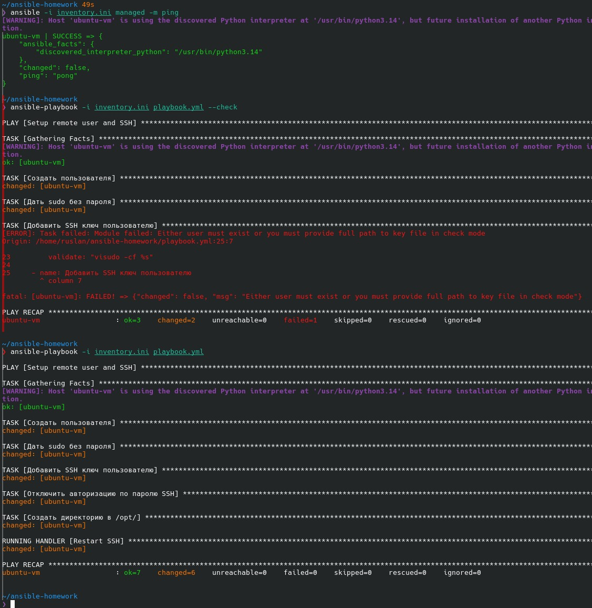
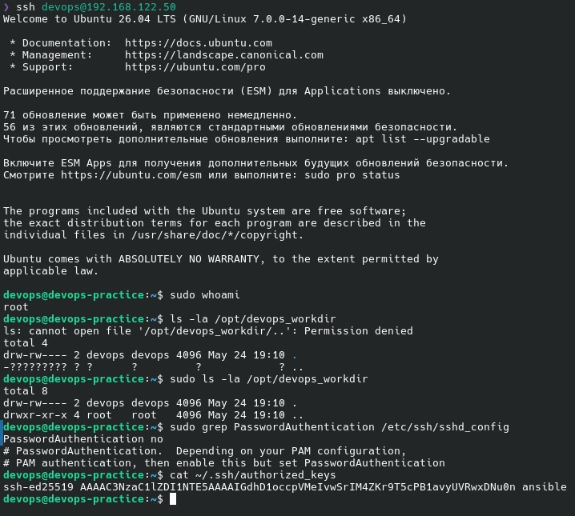

# Домашняя работа №2 — Ansible Playbook

## Задание

- Создать пользователя на удалённой машине
- Дать пользователю права sudo
- Настроить авторизацию SSH по ключам
- Отключить авторизацию по паролю при SSH подключении
- Создать директорию в `/opt/` с правами `660` для пользователя

---

## Запуск

Скопировать публичный SSH ключ на управляемый хост:

```bash
ssh-copy-id -i ~/.ssh/id_ed25519.pub ruslan@192.168.122.50
```

Запустить playbook:

```bash
ansible-playbook -i inventory.ini playbook.yml
```

---

## Результат



**check1** — вывод `ansible-playbook` и проверка `ansible -i inventory.ini managed -m ping`



**check2** — подключение по SSH под `devops`, проверка `sudo whoami`, прав `/opt/devops_workdir` и `sshd_config`


